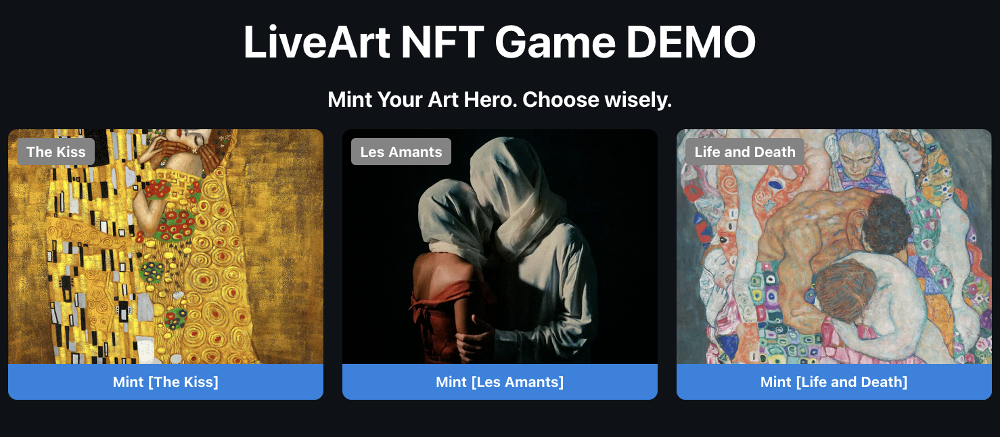
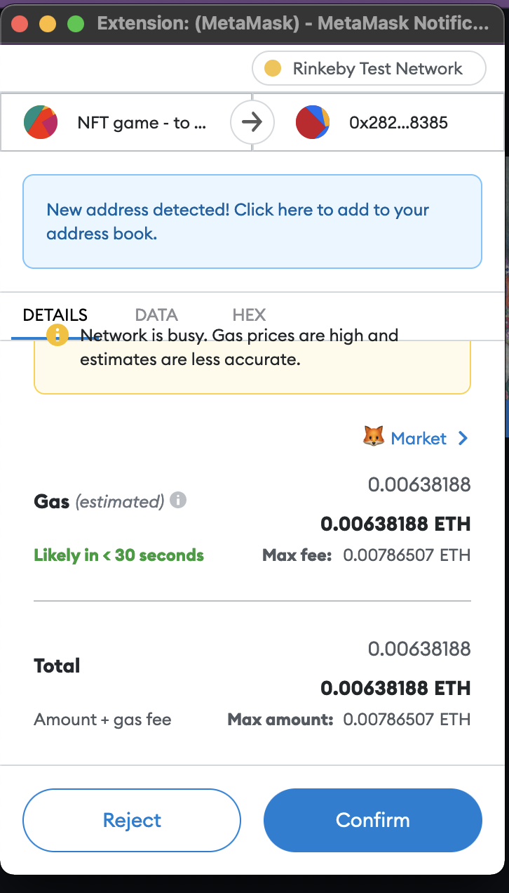
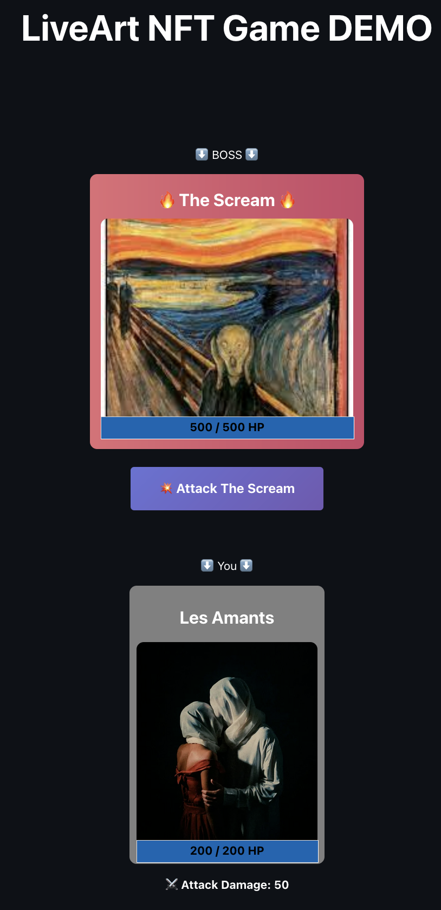
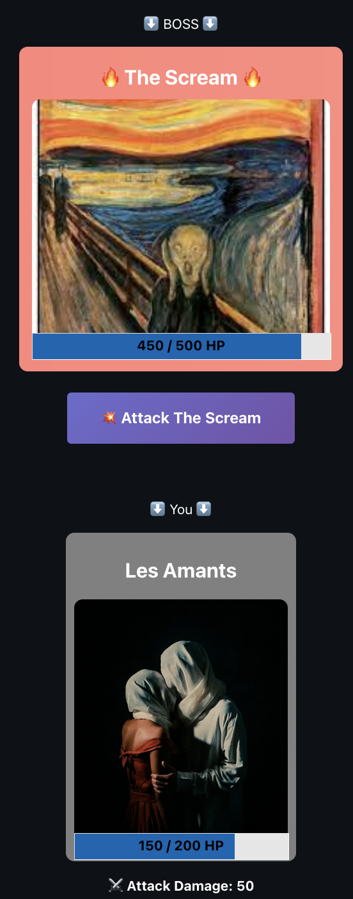

# Art NFT Gamification Demo

This project demonstrates a turn-based NFT game with famous art works.

## Game Objective

Do you know the famous art painting called "The Scream" created by Edvard Munch? 

So your objective is to FIGHT against this MONSTER with your chosen HERO.

You can choose your HERO among three paintings available at the moment. 

There are :
- The Kiss [Gustav Klimt]
- The Lovers [Rene Magritte]
- Death and Live [Gustav Klimt]

## How to play

1) Click on one of your favorite painting to fight against "The Scream".

2) Choose your wallet on Rinkeby and confirm the minting transaction. 

3) Once your HERO painting is minted to your wallet address, now you can click on "Attack The Scream" to fight againt the monster! You can see that the monster has more HP than you! Once again, the metamask window will pop up and you need to confirm the transaction!

4) Ohh.... SAD... seems like you need to team up with others to defeat this monster. It has more damage and hp than you!

